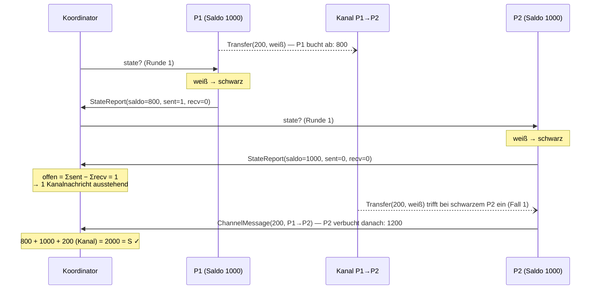
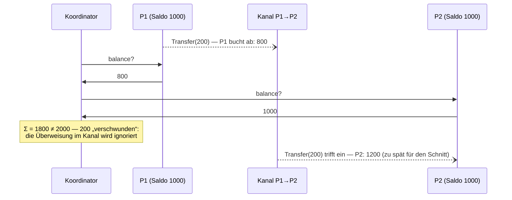
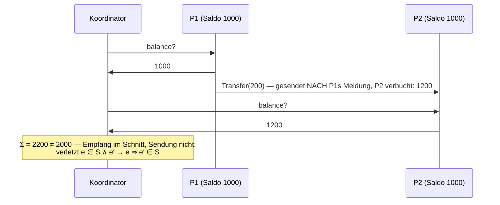

# Übungsblatt 2 — Schnappschuss eines konsistenten globalen Zustands

Bericht zur Portfolioprüfung Teil 2, Verteilte Systeme Sommer 2026.
Begleitliteratur: **G. Coulouris, J. Dollimore, T. Kindberg, G. Blair:
*Distributed Systems — Concepts and Design*, 5. Auflage, Addison-Wesley 2012**
(im Folgenden zitiert als *Coulouris*).

## 1 Überblick: Was wurde umgesetzt

Die gesamte Lösung zu den Aufgaben 1–3 liegt in **einer** Datei:

```
test/org/oxoo2a/uebung2/BankhausTest.java
```

Sie enthält die verteilte Anwendung (`BankNode`), den Schnappschuss-Koordinator
(`Coordinator`), alle Nachrichtentypen als `record`s sowie drei JUnit-Tests, die die
Experimente aus Aufgabe 3 ausführen. Ausführen mit:

```
./gradlew test --tests "org.oxoo2a.uebung2.BankhausTest"
```

| Test | Aufgabe | zeigt |
|---|---|---|
| `aufgabe1und2_eingefaerbterSchnappschussIstKonsistent` | 1, 2, 3.1 | Konten + Kanäle = S, bei jedem Schnappschuss |
| `aufgabe3_naiverSchnappschussIstInkonsistent` | 3.2 | naive Abfrage „verliert“ Geld |
| `aufgabe3_statistik` | 3.3 | Kontrollnachrichten in Abhängigkeit von n |

Gemäß Aufgabenblatt wurde das Simulationsverhalten „verschärft“:

* **Nachrichtenlatenz:** Jede Überweisung wird über einen virtuellen Thread mit
  zufälliger Verzögerung (z. B. 50–300 ms) zugestellt und ist damit merklich lange
  „unterwegs“ (Methode `sendLater`).
* **FIFO abgeschaltet:**
  `SimulationBehavior.setMessageQueueSelectionDistributionFunction(RandomValues.getUniformDistribution())`
  — Empfänger ziehen eine zufällige Nachricht aus ihrer Warteschlange, Umordnung ist
  die Regel, nicht die Ausnahme.

## 2 Aufgabe 1 — Das Bankhaus

n vollständig vernetzte Prozesse (`BankNode`) führen je ein Konto mit Startsaldo 1000;
die Gesamtsumme ist S = n · 1000. Jeder Prozess schickt sich selbst in zufälligen
Abständen eine `Tick`-Nachricht; bei jedem Tick überweist er einen zufälligen Betrag
0 < b ≤ Saldo an einen zufälligen anderen Prozess: Er bucht b **sofort** ab und sendet
`Transfer(b)` mit zufälliger Latenz. Der Empfänger schreibt b bei Eintreffen gut.

Die Invariante der Anwendung — **Σ Konten + Σ unterwegs befindliche Überweisungen = S** —
entspricht genau der Motivation in *Coulouris, Kap. 14.5 (Global states)*: Der globale
Zustand eines verteilten Systems besteht aus den lokalen Prozesszuständen **und** den
Kanalzuständen; wer die Kanäle ignoriert, sieht ein System, in dem „Geld verschwindet“.
Coulouris illustriert dasselbe an zwei Prozessen, die Waren gegen Geld tauschen und bei
denen mitten in der Übertragung weder Geld noch Ware auf einem der beiden Konten sichtbar ist.

## 3 Aufgabe 2 — Schnappschuss-Algorithmus

### 3.1 Gewählte Variante: (a) Koordinator-/Einfärbeverfahren

Ein Koordinator startet den Schnappschuss per Multicast `state?` (Kontrollnachricht mit
Rundennummer). Die **Farbe ist als Epochennummer** umgesetzt: Ein Prozess mit
`epoch < r` ist „weiß“ bezüglich Runde r, mit `epoch ≥ r` „schwarz“. Das erlaubt beliebig
viele aufeinanderfolgende Schnappschüsse ohne Zurücksetzen der Farben. Jede
Basisnachricht `Transfer(b, epoch)` trägt die Epoche ihres **Senders zum Sendezeitpunkt**
— die Einfärbung reist also mit der Nachricht.

Ablauf beim Empfang von `state?` (Runde r) durch einen weißen Prozess:
Farbwechsel weiß → schwarz, lokalen Zustand (Saldo) festhalten und als
`StateReport(r, saldo, sent, received)` an den Koordinator melden. `sent`/`received`
sind kumulative Zähler der gesendeten/verbuchten Transfers — sie dienen der
Terminierungserkennung (s. u.).

### 3.2 Die beiden Einfärbungsfälle

**Fall 1 — schwarzer Prozess empfängt weiße Nachricht** (nachträglich eintreffende
Basisnachricht): Die Nachricht wurde vor dem Schnitt gesendet und nach dem Schnitt
empfangen — sie war zum Schnittzeitpunkt im Kanal und **gehört zum aufgezeichneten
Zustand**. Von den beiden Lösungsvarianten der Vorlesung ist umgesetzt:

> **Der Empfänger schickt eine Kopie als `ChannelMessage(betrag, von, nach)` an den
> Koordinator** und verbucht die Nachricht anschließend normal.

Begründung gegenüber der Alternative (die Nachricht dem bereits gemeldeten lokalen
Zustand des Empfängers nachträglich zuzuschlagen): (1) Das Aufgabenblatt verlangt
lokale Zustände und Kanalzustände **getrennt** — nur die Nachmeldung als Kanalzustand
hält diese Trennung sauber und erlaubt die Ausgabe „alle Kanalinhalte“. (2) Es sind
keine Korrektur-/Zweitmeldungen bereits gemeldeter Salden nötig. (3) Der Empfänger ist
der einzige Ort, an dem „war noch unterwegs“ überhaupt beobachtbar wird — der Sender
kann nicht wissen, welche seiner Nachrichten den Schnitt kreuzen.

**Fall 2 — weißer Prozess empfängt schwarze Nachricht** („Nachricht aus der Zukunft“):
Würde der weiße Prozess sie einfach verbuchen, enthielte sein später gemeldeter Zustand
einen Empfang, dessen Sendeereignis **nicht** im Schnitt liegt — der Schnitt wäre
inkonsistent. Umsetzung:

> **Der Empfänger führt zuerst seinen eigenen Schnappschuss aus** (Farbwechsel, Zustand
> melden, als hätte ihn `state?` erreicht) **und verbucht die Nachricht erst danach.**

Damit rückt der Empfang hinter den Schnitt, und die Konsistenzbedingung bleibt erfüllt.
Das ist derselbe Trick, mit dem bei Chandy-Lamport der Marker das Festhalten des
Zustands erzwingt (*Coulouris, Kap. 14.5, „marker receiving rule“*), hier huckepack auf
jeder Basisnachricht — dadurch funktioniert er auch, wenn die `state?`-Kontrollnachricht
von Basisnachrichten überholt wird.

### 3.3 Terminierung ohne FIFO: Zählmethode

Wann hat der Koordinator alle Kanalnachrichten gesehen? Jeder Prozess meldet mit seinem
Zustand die Zähler `sent` und `received`. Zum Schnittzeitpunkt waren genau

```
offen = Σ sentᵢ − Σ receivedᵢ
```

Überweisungen unterwegs. Jede davon trifft (endliche Latenz, keine Verluste) irgendwann
bei einem schwarzen Prozess ein und erzeugt **genau eine** `ChannelMessage`. Der
Koordinator ist fertig, sobald n Zustandsmeldungen und `offen` Kanalnachrichten
vorliegen — ganz ohne Annahmen über Reihenfolgen. Anschließend gibt er den vollständigen
globalen Zustand aus (alle Salden, alle Kanalinhalte, Gesamtsumme).

### 3.4 Annahmen und die Konsequenzen des Nicht-FIFO-Verhaltens

Annahmen (vgl. Vorlesung; ebenso *Coulouris, Kap. 14.5* für Chandy-Lamport): keine
Nachrichtenverluste und keine Duplikate (garantiert sim4da), keine Prozessabstürze,
vollständige Vernetzung, endliche Übertragungszeit. **Nicht** angenommen wird FIFO.

Das klassische **Chandy-Lamport-Verfahren (Variante b) setzt FIFO-Kanäle voraus**: Der
Marker wirkt dort als „Schleuse“ — alles, was auf einem Kanal vor dem Marker eintrifft,
gehört zum Kanalzustand, alles danach nicht. Ohne FIFO kann ein Marker ältere
Basisnachrichten überholen (sie würden fälschlich nicht aufgezeichnet) oder von jüngeren
überholt werden (sie würden fälschlich aufgezeichnet). Genau deshalb wurde hier die
Einfärbevariante gewählt: Die Schnitt-Zugehörigkeit steckt **in jeder Nachricht selbst**
(Epoche des Senders) statt in der **Position** der Nachricht relativ zu einem Marker.
Beliebige Umordnung — durch die zufällige Latenz ebenso wie durch die zufällige
Warteschlangenauswahl — ändert an der Korrektheit nichts; die Kanalaufzeichnung bleibt
exakt, wie die Experimente zeigen.

## 4 Aufgabe 3 — Konsistenz experimentell nachweisen

### 4.1 Eingefärbter Schnappschuss: Summe stets S

Die Schnappschüsse laufen mitten im Betrieb (das Überweisen geht währenddessen weiter).
Ergebnis über alle Testläufe (n = 3, 5, 6, 10; insgesamt 25 Schnappschüsse): **jeder
eingefärbte Schnappschuss liefert exakt S.** Beispiel aus dem Lauf mit n = 6 (S = 6000):

```
[Schnappschuss 1] Konten {B1-0=4, B1-1=6, B1-2=624, B1-3=1094, B1-4=277, B1-5=122}  Σ=2127
[Schnappschuss 1] Kanäle: B1-3→B1-1: 47, B1-4→B1-5: 1, … (36 Nachrichten)          Σ=3873
[Schnappschuss 1] Gesamtsumme 6000, S=6000
```

Bemerkenswert: Fast zwei Drittel des Geldes waren zum Schnittzeitpunkt **im Kanal** —
ohne Kanalaufzeichnung wäre der Zustand grob falsch.

### 4.2 Naiver Schnappschuss: inkonsistent

Der naive Vergleichs-Schnappschuss (Koordinator fragt nur Salden ab, Kanäle werden
ignoriert) lief in denselben Läufen unmittelbar nach jedem konsistenten Schnappschuss:

```
[Naiv]  Σ Konten=536,  S=6000  ← inkonsistent, Differenz −5464
[Naiv]  Σ Konten=1204, S=6000  ← inkonsistent, Differenz −4796
```

Geld „verschwindet“, weil unterwegs befindliche Überweisungen beim Sender schon
abgebucht, beim Empfänger aber noch nicht gutgeschrieben sind. Der umgekehrte Effekt
(Geld „entsteht“) tritt auf, wenn eine **Nachricht aus der Zukunft** einläuft: Der
Empfänger meldet einen Saldo, der eine Gutschrift enthält, deren Abbuchung der Sender
erst **nach** seiner eigenen Meldung vorgenommen hat.

Das ist genau der Begriff des **konsistenten Schnitts** (*Coulouris, Kap. 14.5.1, Global
states and consistent cuts*): Ein Schnitt S ist konsistent, wenn er zu jedem enthaltenen
Ereignis auch alle kausal davorliegenden Ereignisse enthält —

> e ∈ S ∧ e′ → e ⇒ e′ ∈ S

mit → als Happened-before-Relation (*Coulouris, Kap. 14.4*). Die Nachricht aus der
Zukunft verletzt die Bedingung: Das Empfangsereignis liegt im Schnitt, das zugehörige
Sendeereignis nicht. Der eingefärbte Algorithmus schließt beide Fehlerbilder aus —
Fall 1 erfasst die den Schnitt kreuzenden Nachrichten (nichts verschwindet), Fall 2
verhindert Empfänge ohne Sendung (nichts entsteht).

### 4.3 Zeit-/Sequenzdiagramme

**Konsistenter Schnitt (Einfärbeverfahren), 2 Prozesse, S = 2000.** Die gestrichelten
Pfeile über den „Kanal“-Teilnehmer machen die Übertragungslatenz sichtbar; der Schnitt
verläuft durch die beiden Farbwechsel:



**Inkonsistenter Schnitt (naiv), Geld verschwindet:**



**Inkonsistenter Schnitt (naiv), Geld entsteht — „Nachricht aus der Zukunft“:**



### 4.4 Statistik: n und Überweisungsfrequenz variiert

Gemessen (Test `aufgabe3_statistik`, je 3 Schnappschüsse pro Konfiguration, Latenz
100–300 ms; „Takt“ = Wartezeit zwischen zwei Überweisungen eines Prozesses):

| n | Takt [ms] | Kontrollnachrichten je Schnappschuss (Ø) | davon Kanalnachrichten (Ø) |
|---:|---:|---:|---:|
| 3 | 10–50 | 26,0 | 20,0 |
| 6 | 10–50 | 48,3 | 36,3 |
| 10 | 10–50 | 83,3 | 63,3 |
| 6 | 80–200 | 20,0 | 8,0 |

Der Aufwand folgt dem Modell **2n + f**: n `state?`-Nachrichten, n Zustandsmeldungen und
f Kanalnachrichten, wobei f — die Zahl der den Schnitt kreuzenden Überweisungen — mit
n · Überweisungsrate · Latenz wächst (vgl. Zeilen 2 und 4: gleiche n, ein Achtel des
Verkehrs ⇒ f fällt von 36,3 auf 8,0). Alle 12 Schnappschüsse lieferten auch hier exakt S.

Damit bestätigen sich die in der Vorlesung genannten **Nachteile** von
Schnappschuss-Algorithmen:

* **Hohes Nachrichtenaufkommen:** O(n) Kontrollnachrichten pro Schnappschuss plus eine
  Nachmeldung **pro kreuzender Basisnachricht** — bei hoher Last dominiert f (63 von 83
  Nachrichten bei n = 10). Periodisches Beobachten des Systems wird teuer.
* **„Nicht verteilt genug“:** Der Koordinator ist Initiator, Sammelstelle und Engpass
  zugleich — alle 2n + f Nachrichten laufen bei ihm zusammen, und er ist ein Single
  Point of Failure. Auch das dezentrale Chandy-Lamport-Verfahren initiiert zwar
  beliebig, muss die Teilzustände am Ende aber ebenfalls einsammeln; zudem beobachtet
  ein Schnappschuss nur *einen* möglichen konsistenten Zustand, der so nie „gleichzeitig“
  existiert haben muss (*Coulouris, Kap. 14.5: Erreichbarkeit des Schnappschuss-Zustands
  in einer möglichen Linearisierung; vertieft in Kap. 14.6, Distributed debugging*).

## 5 Literatur

* Coulouris, Dollimore, Kindberg, Blair: *Distributed Systems — Concepts and Design*,
  5. Aufl., Addison-Wesley 2012 — Kap. 14.4 (logische Zeit, Happened-before),
  Kap. 14.5 (Global states: konsistente Schnitte; der Schnappschuss-Algorithmus von
  Chandy und Lamport samt FIFO-Annahme), Kap. 14.6 (Distributed debugging).
* K. M. Chandy, L. Lamport: *Distributed Snapshots: Determining Global States of
  Distributed Systems*, ACM TOCS 3(1), 1985 (Originalarbeit, in Coulouris Kap. 14.5
  behandelt).
* Vorlesung Verteilte Systeme, Kap. 4 (Algorithmen), Abschnitt „Schnappschüsse“.
